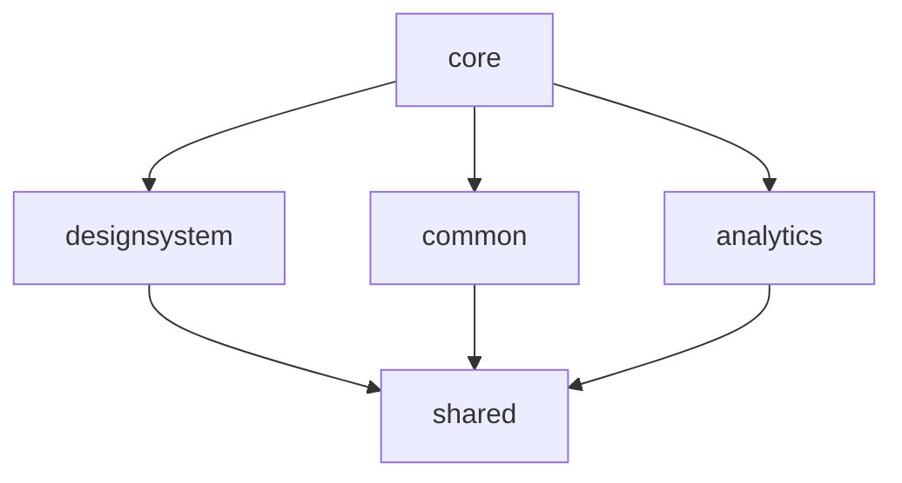
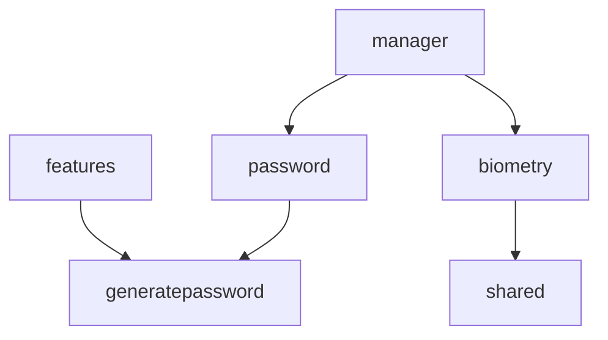
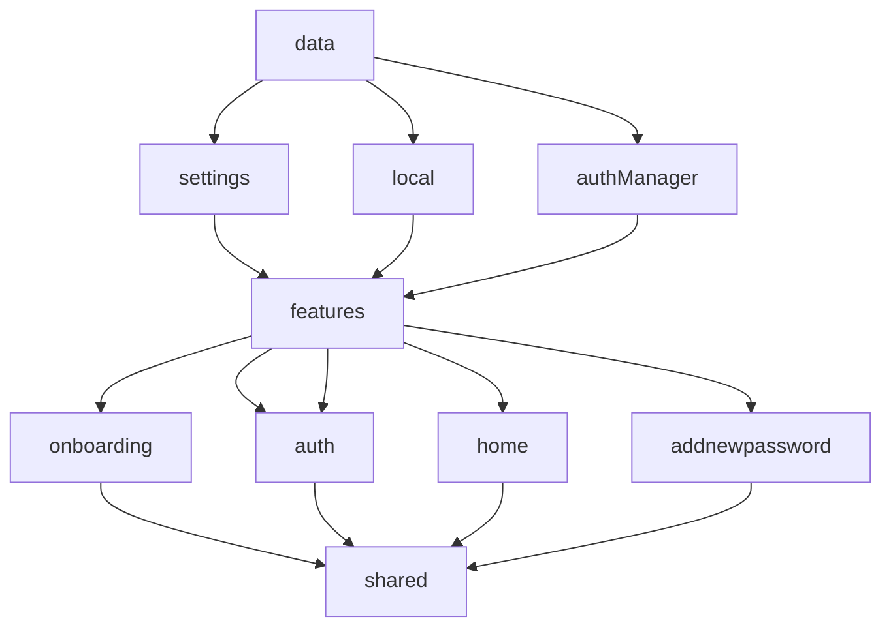
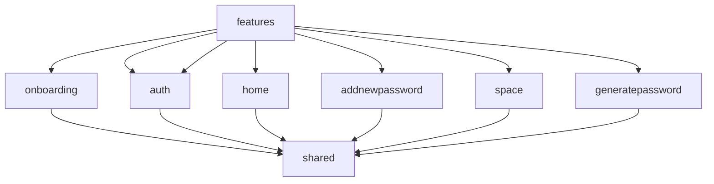

<h1 align="center"><a href="https://github.com/getspherelabs/locker-kmp">AnyPass: Password Manager & Authenticator</a></h1> 

    

# Modularization
Modularization is the practice of breaking the concept of a monolithic, one-module codebase into loosely coupled, self contained modules.

A barebone module is simply a directory with a Gradle build script inside. Usually though, a module will consist of one or more source sets and possibly a collection of resources or assets. Modules can be built and tested independently. Due to Gradle's flexibility there are few constraints as to how you can organize your project. In general, you should strive for low coupling and high cohesion.

- **Low coupling** - Modules should be as independent as possible from one another, so that changes to one module have zero or minimal impact on other modules. They should not possess knowledge of the inner workings of other modules.
- **High cohesion** - A module should comprise a collection of code that acts as a system. It should have clearly defined responsibilities and stay within boundaries of certain domain knowledge.

### Core Module:

### Manager Module:

### Data Module:

### Feature Module:

## Project Requirements

- Java 17+
- iOS: 14.0+
