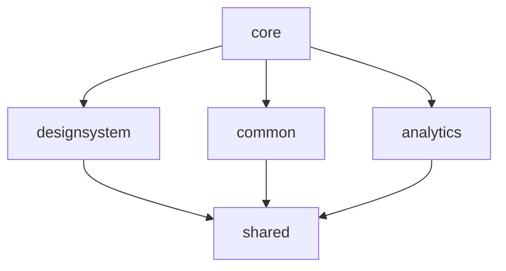
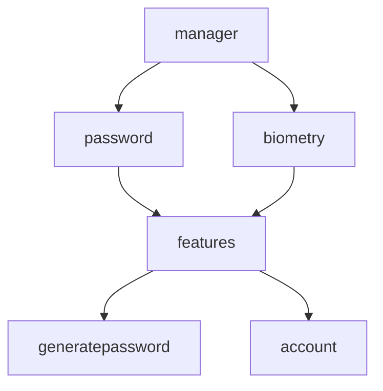
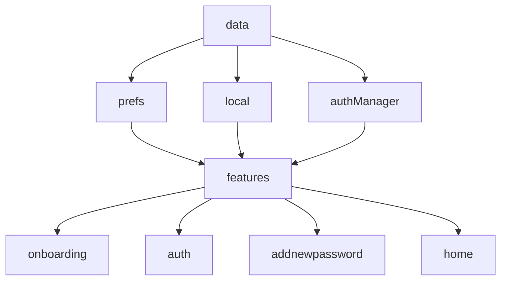
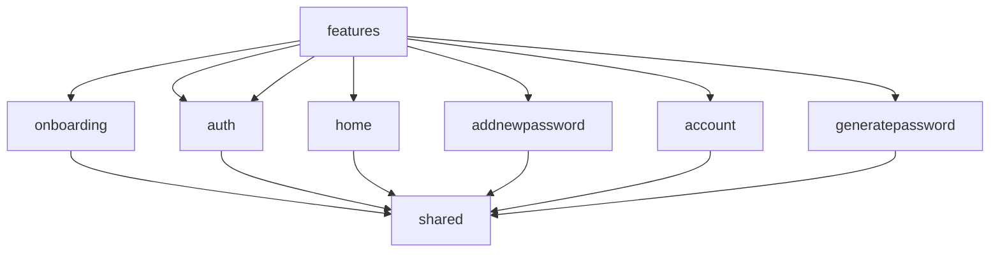

<p align="center">
  <a href="https://github.com/getspherelabs/anypass-kmp"></a>
</p>

<p align="center">
<a href="">
    
</a>
<a href="">
    
</a>    
<a href="">
    
</a>   
<a href="">
    
</a> 
</a> 
<a href="">
    
</a>  
</p>

# AnyPass (Work In Progress ⛏)

[AnyPass]() is your one-stop solution for password management, password generation, and password health analysis.

# Architecture
The app architecture has three layers: a data layer, a domain layer and a UI layer. AnyPass uses Meteor KMP to create application using MVI architecture. It provides a unidirectional data flow (UDF), allowing you to handle state changes and propagate them to the UI efficiently.

### Single source of truth

When a new data type is defined in your app, you should assign a Single Source of Truth (SSOT) to it. The SSOT is the owner of that data, and only the SSOT can modify or mutate it. To achieve this, the SSOT exposes the data using an immutable type, and to modify the data, the SSOT exposes functions or receive events that other types can call.

This pattern brings multiple benefits:

- It centralizes all the changes to a particular type of data in one place.
- It protects the data so that other types cannot tamper with it.
- It makes changes to the data more traceable. Thus, bugs are easier to spot.

In an offline-first application, the source of truth for application data is typically a database. In some other cases, the source of truth can be a ViewModel or even the UI.
# Technology

- [Kotlin](https://kotlinlang.org)
- [Compose Multiplatform](https://www.jetbrains.com/lp/compose-multiplatform)
- [Kotlin Coroutine](https://kotlinlang.org/docs/coroutines-overview.html)
- [Swift](https://www.swift.org)
- [SqlDelight](https://github.com/cashapp/sqldelight)
- [Koin](https://insert-koin.io)
- [Meteor](https://github.com/getspherelabs/meteor-kmp)
- [Firebase](https://firebase.google.com)
- [Sentry](https://sentry.io)
- [Google Admob](https://admob.google.com)
- [Multiplatform Settings](https://github.com/russhwolf/multiplatform-settings)
- [Moko Resource](https://github.com/icerockdev/moko-resources)
- [Sentry Multiplatform](https://docs.sentry.io/platforms/kotlin-multiplatform)
- [BuildKonfig](https://github.com/yshrsmz/BuildKonfig)
- [Coil](https://github.com/coil-kt/coil)
- [Meteor ViewModel](https://github.com/getspherelabs/meteor-kmp)
- [Turbine](https://github.com/cashapp/turbine)
- [Ktlint](https://github.com/pinterest/ktlint)
- [Spotless](https://github.com/diffplug/spotless)
- [Jacoco](https://github.com/jacoco/jacoco)
- [AssertK](https://github.com/willowtreeapps/assertk)
- [Konsist](https://github.com/LemonAppDev/konsist)
- [Lyricist](https://github.com/adrielcafe/lyricist)
- [Uri-kmp](https://github.com/eygraber/uri-kmp)
- [Test-logger](https://github.com/radarsh/gradle-test-logger-plugin)
- [CameraX](https://developer.android.com/jetpack/androidx/releases/camera)
- [MLKit](https://developers.google.com/ml-kit)

# Modularization
Modularization is the practice of breaking the concept of a monolithic, one-module codebase into loosely coupled, self contained modules.

A barebone module is simply a directory with a Gradle build script inside. Usually though, a module will consist of one or more source sets and possibly a collection of resources or assets. Modules can be built and tested independently. Due to Gradle's flexibility there are few constraints as to how you can organize your project. In general, you should strive for low coupling and high cohesion.

- **Low coupling** - Modules should be as independent as possible from one another, so that changes to one module have zero or minimal impact on other modules. They should not possess knowledge of the inner workings of other modules.
- **High cohesion** - A module should comprise a collection of code that acts as a system. It should have clearly defined responsibilities and stay within boundaries of certain domain knowledge.

### Core Module:


### Manager Module:



### Data Module:



### Feature Module:



# Setup

1. Check your **Xcode** version is 14.1 or newer. Additionally, check your **Android Studio** version is Flamingo or newer. 

2. Clone the repository using the following command:

    ```
    https://github.com/getspherelabs/anypass-kmp.git
    ```

3. When building the iOS app, you may face common issues:

    - **Issue**: ```Unicode Normalization not appropriate for ASCII-8BIT```
    - **Solution**: Try add your `~/.zprofile`, `~/.zshrc` files:
      
      ```
       LANG=en_US.UTF-8
       LANGUAGE=en_US.UFT-8
       LC_ALL=en_US.UFT-8
      ```
    - **Issue**: Sometimes you can not build your iOS app from Xcode 
    - **Solution**: Follow these steps after executing the cleanup script:
      
      1. `pod deintegrate`
      2. `pod init`
      3. Copy the `pod` modules
      4. `pod install`

4. Build and run the app on your **Android / iOS** device or simulator.

> :warning: Make fake `google-services`.json for building properly.

5. We recommend including linkers from Xcode. To include linkers from Xcode, follow these steps:
   
    1. Navigate to **iosApp/Build Settings/Linking**.
    2. Add the following linkers to your **Other Linking Flags**:
        - `lsqlite3`
        - `ObjC`
       
# Screenshots

## Contribute

**Want to contribute?** See **[CONTRIBUTING.md](/CONTRIBUTING.md)** [](https://github.com/getspherelabs/anypass-kmp/fork)


## Project Requirements

- Java 17+
- iOS: 14.0+
